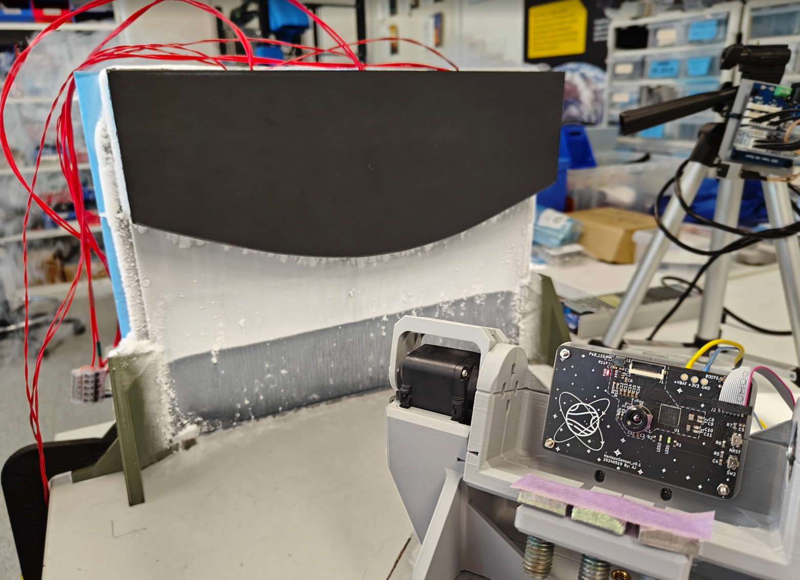
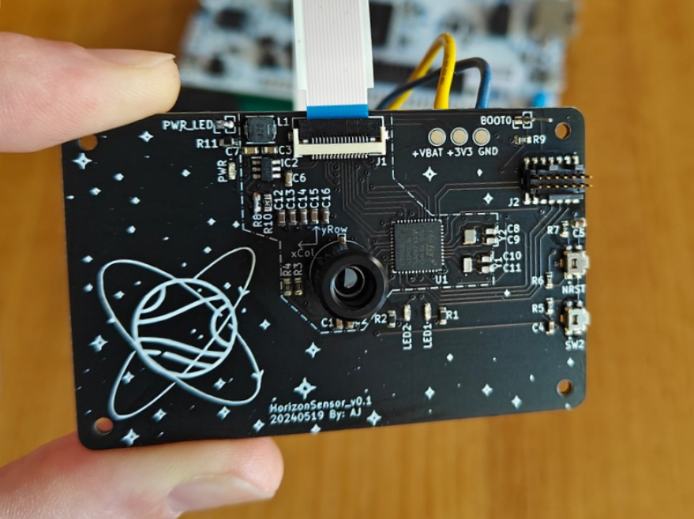
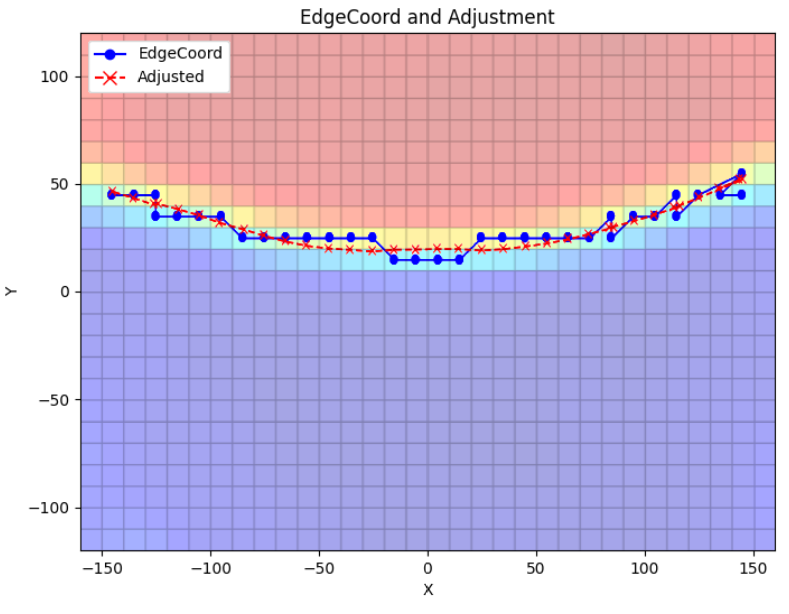
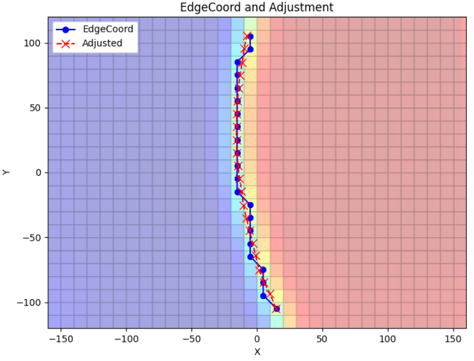
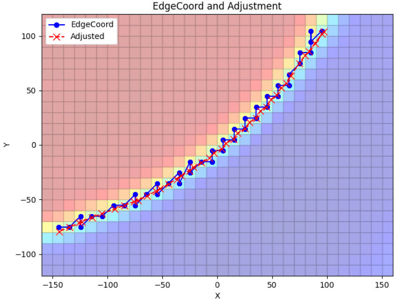

# infraredHorizonSensor
A project to build a prototype infrared horizon sensor using a thermopile imaging array for CubeSat orbital attitude determination.

Check out the [video presentation summarising the research here](https://youtu.be/ipN0h2YGPOc?si=D6N8nWLN3bS8p15P).

Traditional image-based horizon sensors provide orientation information by detecting planetary edges against the background of space, a process often performed using visible light cameras due to the typically limited resolution of infrared imaging sensors. This study illustrates some of the advantages of using the infrared band for horizon detection, and explores recent advancements in sub-pixel edge localisation techniques, specifically the Zernike polynomials, to improve the performance of low-resolution thermal imaging sensors for horizon detection. To evaluate the utility of this technique, a prototype infrared horizon sensor and simulated infrared orbital view test stand was built to assess its performance.

## Further Details
See research thesis at: [Infrared Horizon Sensor Thesis.pdf](_doc/_InfraredHorizonSensorThesis.pdf)

## Examples
*Infrared horizon sensor and example orbital attitude determination of planets nadir vector:*

  
  

*Example sub-pixel correction to detected pixel-level orbital horizon edge:* 

  
  
  

## Permissive Open-Source Licensing
- **Software**: Licensed under the permissive [MIT License](LICENSE-MIT).
- **Hardware Design Files**: Licensed under the [CERN-OHL-Permissive Open-Source License](LICENSE-CERN-OHL-P).
